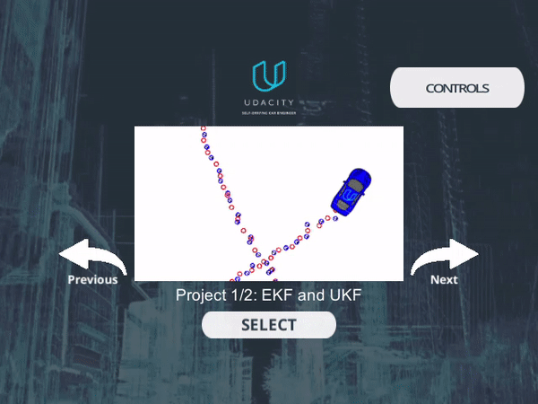

# CarND-Term2-P1-Extended-Kalman-Filter  
## Overview  
In this project, you are going to implement the extended Kalman filter in C++. You will be tracking the bicycle's position and velocity and predicting the positon of the object.  
There is a simulator provided by Udacity ([Term 2 Simulator Release](https://github.com/udacity/self-driving-car-sim/releases/)) which can generate noisy LIDAR and RADAR measurements. And you will be using those measurements to predict your object position.  
Here is the link to the [orginal repository](https://github.com/udacity/CarND-Extended-Kalman-Filter-Project) provided by Udaciy.  
## Prerequisites/Dependencies  
* cmake: 3.5  
  * All OSes: [click here for installation instructions](https://cmake.org/install/)  
* make: 4.1 (Linux and Mac), 3.81 (Windows)  
  * Linux: make is installed by default on most Linux distros  
  * Mac: [install Xcode command line tools to get make](https://developer.apple.com/xcode/features/)  
  * Windows: [Click here for installation instructions](http://gnuwin32.sourceforge.net/packages/make.htm)  
* gcc/g++: 5.4  
  * Linux: gcc / g++ is installed by default on most Linux distros  
  * Mac: same deal as make - [install Xcode command line tools](https://developer.apple.com/xcode/features)  
  * Windows: recommend using [MinGW](http://www.mingw.org/)  
## Setup Instructions (abbreviated)  
1. Meet the `Prerequisites/Dependencies`  
2. Intall `uWebSocketIO ` on your system  
  2.1 Windows Installation  
  2.1.1 Use latest version of Ubuntu Bash 16.04 on Windows 10, here is the [step-by-step guide](https://www.howtogeek.com/249966/how-to-install-and-use-the-linux-bash-shell-on-windows-10/) for setting up the utility.  
  2.1.2 (Optional) Check your version of Ubuntu Bash [here](https://www.howtogeek.com/278152/how-to-update-the-windows-bash-shell/).  
3. Open Ubuntu Bash and clone the project repository  
4. On the command line execute `./install-ubuntu.sh`  
5. Build and run your code.  

## Project Description  
* starter code in the `src` folder
* a README file with instructions on compiling the code
* a `Docs` folder, which contains details about the structure of the code templates
* `CMakeLists.txt` file that will be used when compiling your code (you do not need to change this file)
* a data file for testing your extended Kalman filter which the simulator interface provides
## Run the project  
* Clone this respository
* At the top level of the project repository, create a build directory: `mkdir build && cd build`
* In `/build` directory, compile yoru code with `cmake .. && make`
* Launch the simulator from Windows
* Execute the run command for the project `./ExtendedKF` (Make sure you also run the simulator on the Windows host machine) If you see * * this message, it is working `Listening to port 4567 Connected!!!`

## Project Rubric  
### 1. Compiling  
#### 1.1 Your code should compile.  
Compiled successfully.
### 2. Accuracy  
#### 2.2 px, py, vx, vy output coordinates must have an RMSE <= [.11, .11, 0.52, 0.52] when using the file: "obj_pose-laser-radar-synthetic-input.txt" which is the same data file the simulator uses for Dataset 1.  
Meet
### 3. Follows the Correct Algorithm  
#### 3.1 Your Sensor Fusion algorithm follows the general processing flow as taught in the preceding lessons.  
My Kalman Filter implementation is completed at [`kalman_filter.cpp`](./src/kalman_filter.cpp)  
#### 3.2 Your Kalman Filter algorithm handles the first measurements appropriately.  
The first measurement is handled at [`FusionEKF.cpp` Line79-130](./src/FusionEKF.cpp#L79-L130)  
#### 3.3 Your Kalman Filter algorithm first predicts then updates.  
My Kalman Filter predict function will be called at [`FusionEKF.cpp` Line132-166](./src/FusionEKF.cpp#L132-L166)  
My Kalman Filter update function will be called after predict function at [`FusionEKF.cpp` Line135-192](./src/FusionEKF.cpp#L168-L192)  
#### 3.4 Your Kalman Filter can handle radar and lidar measurements.  
My Kalman Filter update function will handle them at [`FusionEKF.cpp` Line135-192](./src/FusionEKF.cpp#L168-L192)  
### 4. Code Efficiency  
#### 4.1 Your algorithm should avoid unnecessary calculations.  
Yes.

## Code Style  
Please (do your best to) stick to [Google's C++ style guide](https://google.github.io/styleguide/cppguide.html).

## Videos
Video recordings for success cases.  
Success to plan path on dataset 1.  
  
Success to plan path on dataset 2.  
  